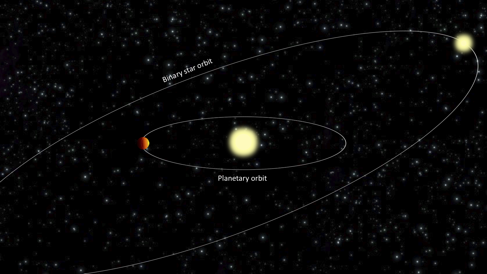
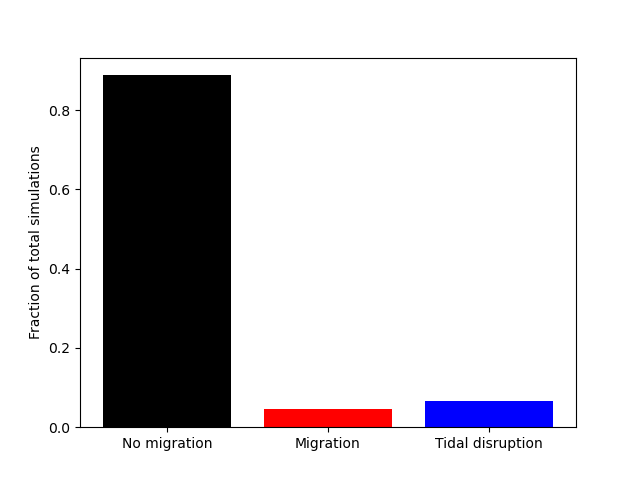
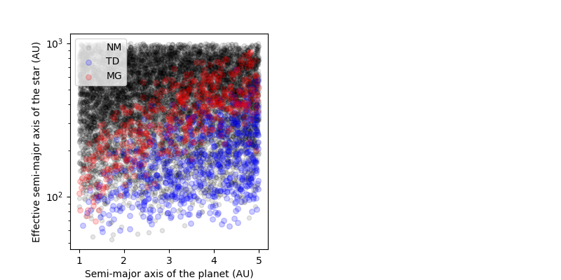
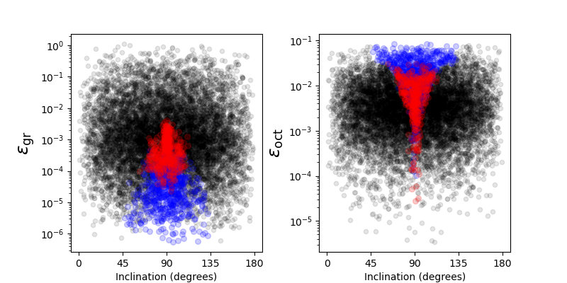
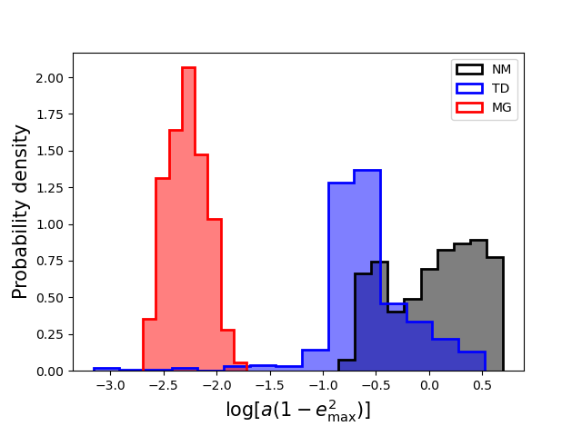
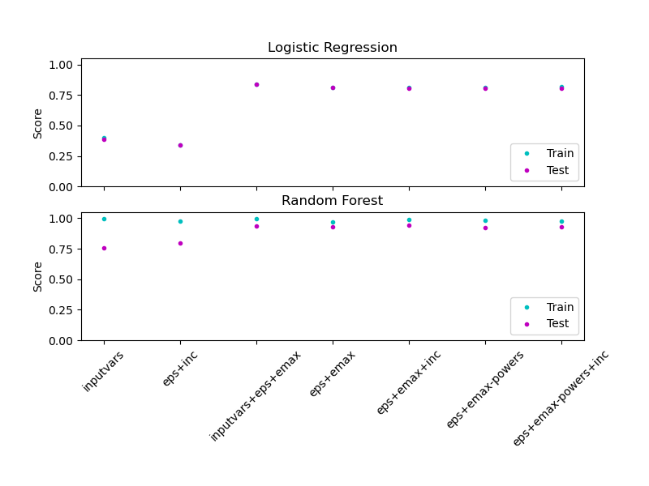
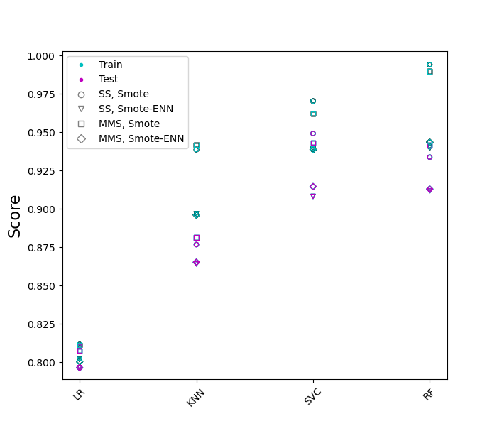
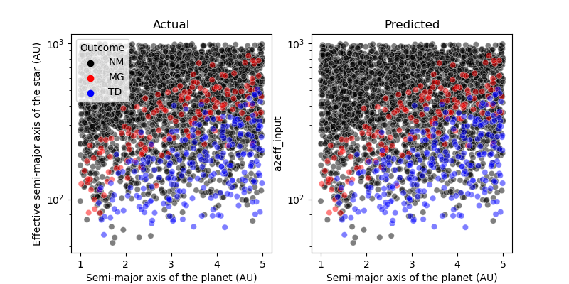
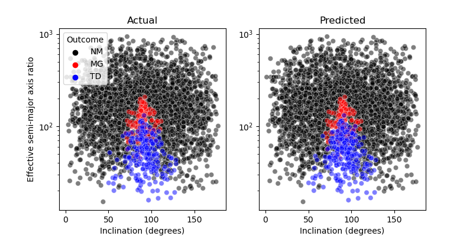

# Using Machine Learning to Predict Dynamical Outcomes in Planetary Systems

## Overview

<figure>

<figcaption> Fig.1
</figure>

The code in this repository uses machine learning to classify the outcomes of gravitational interactions in planetary systems. Here we focus on planets in binary star systems, consisting of a Jupiter-like planet orbiting a single star, with a distant second star orbiting the planet-hosting star. This configuration is illustrated Fig. 1. Under some circumstances, the distant star can perturb the orbit of the planet, causing the shape of the planet's orbit to vary with time. In rare occasions, these gravitational perturbations can cause the planet's eccentricity to be excited, so that tidal interactions with the host star cause the orbit to gradually shrink. The planet thus gradually migrates inward, close to its host star. This scenario has been proposed to explain the puzzling existence of ["hot Jupiters"](https://en.wikipedia.org/wiki/Hot_Jupiter) (large gas giants observed to orbit astonishingly close to their host stars, where the anticipated conditions should prevent planets from forming in the first place). Whether or not planets undergo migration depends on the initial geometries of the planetary and stellar orbits, as well as the the properties of the planets and stars. Previous studies have simulated the dynamical evolution of planets in binary star systems for a wide range of initial conditions for the orbits. Details of these simulations may be found in [Anderson, Storch, & Lai 2016](https://ui.adsabs.harvard.edu/abs/2016MNRAS.456.3671A/abstract) and in [this GitHub repository](https://github.com/kassandra-anderson/EvolveTriples).

This code performs multi-class classification using the simulation data of planets in binary star systems. For a system with specified star/planet masses and radii, and a given set of initial conditions for the planetary and stellar orbits, we aim to qualitatvely predict the final state of the planetary orbit on long timescales (~Gyrs). Specifically, we want to determine whether a specified three-body system will result in inward migration of the planet, resulting in a hot Jupiter. 

The code utilizes the following Python packages: `scikit-learn`, `imbalanced-learn`, `scipy`, `numpy`, `pandas`, `matplotlib`, and `seaborn`.

## Analysis

### Summary of the Data Set

The simulations work in terms of the eccentricity and angular momentum vectors for each orbit. These may be translated more intuitively into orbital elements, where the shape, size, and orientation of each orbit is characterized by the semi-major axis eccentricity, and three angular variables (inclination, argument of pericenter, and longitude of ascending node). Upon specification of stellar and planetary masses, and initial values for these orbital elements, the simulations evolve this three-body system for a timespan of 5 billion years, similar to typical ages inferred for most observed planetary systems.

The initial conditions for the simulations were generated by sampling the parameters as follows:
- Planet masses uniformly in the range 0.3 - 10 Jupiter masses
- Stellar masses uniformly in the range 0.5-2 solar masses
- Initial semi-major axis of the planet uniformly between 1 - 5 astronomical units
- Initial semi-major axis of the binary star's orbit between 100 - 1000 astronomical units
- Initial eccentricity of the binary star's orbit between 0 - 0.9
- Isotropic distribution of inclinations between the two orbits (uniform in cosine of the inclination)
- Argument of pericenter and longitidue of ascending node uniformly between 0 - 360 degrees

We fix the initial eccentricity of the planet to a small value, in line with expectations for planets forming within protoplanetary disks. We have randomly sampled approximately 10,000 initial conditions in this way, and simulated the time evolution of each of these systems, accounting for various physical ingredients (see [https://github.com/kassandra-anderson/EvolveTriples](https://github.com/kassandra-anderson/EvolveTriples) for details). We will use these initial conditions as features for training the ML classification model.

At the end of the simulation, there are three possible outcomes for the planetary orbit (on a qualitative level):
- The orbit of the planet did not undergo significant variation or migration (labeled as "No Migration", or "NM").
- The orbit of the planet shrank substantially, resulting in a hot Jupiter (labeled as "Migration", or "MG").
- The orbit became so small that the planet is expected to be destroyed by tidal forces from its host star (labeled as "Tidal Disruption", or "TD").

Fig. 2 displays the frequencies of each outcome. We see that "No Migration" is by far the most common outcome (89 %), followed by "Tidal Disruption" (7%), and finally migrated planets (4 %).

<figure>

<figcaption> Fig.2: Relative frequencies of the simulation outcomes.
</figure>

The properties of the initial orbits affect the outcome of the simulations. In particular, the inclination between the planetary orbit and binary star orbit, and the size of the planetary orbit compared to the stellar orbit affect the strength of the torque exerted on the planet by the star. This torque in turn determines whether planets migrate or not. This is demonstrated in Fig. 3. Inspecting the figure, we see that there is some degree of clean structure in this parameter space.

<figure>

<figcaption> Fig.3
</figure>

Other physical parameters of interest can be calculated from the masses, radii, and initial orbital elements, and have the potential to provide cleaner classification boundaries. These parameters are dimensionless ratios of various timescales that enter into the problem, and can be strong predictors of the final outcome of the simulations. We will ultimately use these parameters as features in the final classification model. One particularly important parameter is denoted as `epsilon_gr_input` in the dataset; this parameter is related to the apsidal precession rate of the planetary orbit due to general relativity, divided by the apsidal precession rate due to the stellar companion. In brief, if the general relativistic precession is sufficiently rapid (i.e. if `epsilon_gr_input` is sufficiently large), it will quench the torque on the planet from the stellar companion and prevent eccentricity excitation and inward migration. Another parameter of interest is `epsilon_oct_input`, which is the size of the octupole-level perturbation compared to the quadrupole-level perturbation. Systems with large octupole-level torques may undergo migration more easily, but are also at higher risk of being tidally disrupted. Fig. 4 shows `epsilon_gr_input` and `epsilon_oct_input` versus the inclination between the two orbits. Additional, related variables exist, including the degree of apsidal precession from tidal and rotational distortion of each body (`epsilon_tide1_input`, `epsilon_tide2_input`, `epsilon_rot1_input`, `epsilon_rot2_input`). We will also use these as features in model training, although we do not plot them here since they are qualitatively similar to `epsilon_gr_input`. Due to our sampling choices, these parameters span many orders of magnitude. We log transform these and other features for use in the machine learning model. 

<figure>

<figcaption> Fig.4
</figure>

Finally, another potentially useful feature is the maximum achievable eccentricity that the planet can achieve (`emax`). Simulations are required to precisely compute `emax`, but it can be estimated analytically using energy and angular momentum conservation. The function `calc_emax` in the script `process_features.py` calculates this quantity from the raw simulation data (`alldata.csv`), and creates a new file (`alldata_additional_features.csv`) with this and other features added. An more useful quantity is `a_F = a (1 - emax^2)`, where `a` is the initial semi-major axis of the planet. This quantity is an estimate for the final semi-major axis of the planet. The distributions of `a_F`, separated by class, are depicted in the figure below.

<figure>

<figcaption> Fig.5: Distributions of `a_F =  a (1 - emax^2)` separated by class.
</figure>

There are theoretical expectations for high powers of `a_F` to be useful predictors of the dynamical behavior, since the migration timescale depends on a high power of `a_F`. We will explore this possibility when selecting which features to use in training the model.

### Data Preprocessing
We will explore two scaling methods for the data (`StandardScaler` and `MinMaxScaler` in scikit-learn). Due to the imbalanced classes, we will explore several class resampling methods (under and over-sampling) as implemented in [imbalanced-learn](https://imbalanced-learn.org/stable/). These preprocessing steps are implemented in a Pipeline.

### Model Scoring Metric
Due to the imbalanced classes, we will use the multi-class implementation of the [Matthew's correlation coefficient](https://scikit-learn.org/stable/modules/model_evaluation.html#matthews-corrcoef) as our model scoring metric. This metric is preferable to, say, F1 score for imbalanced classes because it utilizes all entries of the confusion matrix (true and false positives and negatives). For binary classification, a value of +1 indicates perfect correlation between predicted and actual labels, a value of 0 indicates an average random correlation, and -1 indicates an inverse correlation.dicted and actual labels. We thus want to achieve scores as close to 1 as possible on the test data set.

### Key Features

First, we will explore several choices for the input features used in the classifier training. The simplest approach is to directly input each input parameter that is varied in the population synthesis. This includes the masses and orbital elements (semi-major axes, eccentricities, inclinations, and arguments of pericenter/ascending node), and the spin period of the primary. Specifically:
`m_2_input, m_3_input`
`a1_input, a2_input`
`e2_input`
`I1_input, I2_input`
`per1_input, peri2_input`
`node1_input, node1_input`
`Pstar1_input`.
We label this choice of features as `inputvars`, to indicate that these features are the raw input variables to the model.

Better performance is expected by incorporating some physical (i.e., domain) knowledge. In particular, the mutual inclination between the two orbits, `cos_Imut_input`, is known to be an important predictor of the dynamical behavior We will denote inclusion of this feature with the label `inc`. 

In addition the quantities `epsilon_gr_input`, `epsilon_tide1_input`, `epsilon_tide2_input`, `epsilon_rot1_input`, `epsilon_rot2_input` and `epsilon_oct_input` (calculated from the physical and orbital parameters) are known to be important predictors of the dynamical behavior, as discussed previously. We denote this choice of features as `eps`.

Finally, even better performance may be expected by including additional features. In particular, an estimate of the maximum achievable eccentricity of the planet, `emax`, along with the minimum pericenter distance (in units of the tidal disruption radius) `a1(1 - emax)/Rtide`,  `a_F  = a1(1 - emax^2)` (and high powers of `a_F`) are useful in determining whether planets migrate inward, as discussed previously. There are theoretical expectations for `a_F^7` to be an important feature, because it is related to the migration timescale of the planet (see equation 32 of Anderson et al. 2016). We define the set of features including `emax`, `a1(1 - emax)/Rtide`, `a_F`, and `a_F^7` as `emax`. We also separately explore including all powers of `a_F`, between 1-7. We label this choice of features as  `emax-powers`.

First, we explore the following combinations of the input features: `inputvars`, `eps+inc`, `inputvars+eps+emax`, `eps+emax`, `eps + emax+inc`, `eps+emax-powers`, and `eps+emax-powers+inc`.  Here we will consider two classifier models: logistic regression, and random forest. Logistic regression is likely to be an overly simple classifier, but provides qualitative insight and a useful baseline for comparison with other more complex classifiers. We train each combination of classifier and input features by first splitting the data into training and test sets, with the test set comprising 33% of the data (see the script `split_data.py`). For each classifier, we perform a randomized hyperparameter search using 5-fold stratified cross-validation. These calculations are performed by the script `explore_features.py`, which imports `train_tune_score.py` for the actual classifier training. Fig. 6 shows the resulting Matthew's correlation scores obtained by each classifier and feature choice, for both the training and test sets. Inspecting the left panel, we see (not suprisingly) that logistic regression has likely underfit the data, due to the similar test and train scores. However, the figure demonstrates that including only the `inputvars` features results in poor performance, and this performance is dramatically improved by including the `eps` and `emax` features simultaneously. Inspecting the right panel, we see that random forest performs much better than logistic regression, with a similar trend for the input feature performance. The key features are `eps + emax`, and the highest training score is obtained from the combination `eps+emax+inc`, which we will use in all models hereafter.

<figure>

<figcaption> Fig.6: Final model score (using the Matthew's correlation score) after hyperparameter tuning for different feature choices. The top panel shows results for logistic regression, while the bottom panel shows results for a random forest classifier.
</figure>

### Model Selection and Hyperparameter Tuning
Having selected the features `eps+emax+inc`, we next explore different classifiers and perform detailed hyperparameter tuning. We will explore the following classifiers: Logistic regression, K-nearest neighbors, random forest, and a support vector classifier with a Gaussian kernel. We choose the following hyperparameters:

- Logistic Regression: the regularization parameters `C` is varied uniformly between 0.01-100, along with the penalty (`l1` or `l2`).
- K-Nearest Neighbors: the number of neighbors `n_neighbors` is varied uniformly in the range 3-10 and the distance metric `p` takes the values 1 or 2.
- SVC: the regularization parameter `C` is varied uniformly between 0.01-100, and the Gaussian kernel parameter `gamma` is varied uniformly between 0.01-100.
- Random Forest: the integer parameters `n_estimators` and `min_samples_leaf` are varied uniformly between 10-100 and 2-15. We also allow `criterion` to vary (`gini` or `entropy`).

For each classifier, we perform a randomized hyperparameter search using 5-fold cross-validation, and select the highest-performing hyperparameters according to the Matthew's correlation score. We explore two different scaling methods: StandardScaler (denoted as SS), and MinMaxScaler (denoted as MMS). We explore two different resampling procedures available in `imbalanced-learn`: SMOTE and SMOTE-ENN. Figure 7 shows the resulting scores as a function of classifier for different combinations of the scaling and resampling methods. Random Forest, using StandardScaler and SMOTE yields the highest performance on the training data, so we select this combination as the final model. The final hyperparameters after tuning are `criterion = 'entropy'`, `min_samples_leaf = 2`, and `n_estimators = 70`. 

<figure>

<figcaption> Fig.7: Final model score (using the Matthew's correlation score) after hyperparameter tuning for various classifiers and choices for the scaling and resampling methods.
</figure>

### Test Data Analysis
We now examine the predictions of our final classifier (random forest with StandardScaler and SMOTE resampling) on the test data set. This dataset consists of 2912 non-migrating (NM) planets, 220 tidally-disrupted (TD) planets, and 147 migrated (MG) planets. Figures 8 and 9 show the actual and predicted outomes in terms of several input parameters of interest. Excellent agreement between the predicted and actual labels is obtained. 47 total systems were misclassified, including 7 tidally-disrupted systems and 40 non-migrating systems. All migrating plants were classified correctly. These numbers correspond to a total misclassification percentage of 1.4%, and misclassification percentages of 0%, 3.2%, and 1.4% in the MG, TD, and NM classes respectively.

<figure>

<figcaption> Fig.8:  Actual (left panel) versus predicted (right panel), in terms of the planet semi-major aixs and binary effective semi-major axis (in astronomical units).
</figure>

<figure>

<figcaption> Fig.9: Actual (left panel) versus predicted (right panel), in terms of the inclination and effective semi-major axis ratio.
</figure>

### Summary and Conclusions
Based on a set of ~10,000 dynamical simulations of planets in stellar binary systems (as depicted in Figure 1), we have implemented machine learning classification algorithms to predict the dynamical behavior of such systems. For a given system with specified masses and architecture, the possible dynamical outcomes including inward migration due to the gravitational perturbations from the companion star (resulting in a hot Jupiter), tidal disruption of the planet, or no inward migration. Since 90% of our simulations resulted in non-migrating planets, these classes are imbalanced. We have utilized `scikit-learn` in concert with `imbalanced-learn` package to construct and train various multi-class classification models.

We first explored a variety of possible features to use in the classifier training, as well as different choices for feature scaling and data resampling. Our final classification model yields a Matthew's correlation score of 0.93 on the test data set, with accuracies of 0%, 3.2%, and 1.5% in the migrating, tidal-disruption, and non-migrating classes respectively. Possible applications of this model include exploring the dynamical histories of known hot Jupiters in stellar binaries without undertaking detailed numerical simulations.